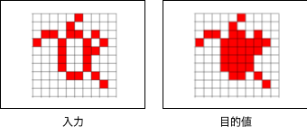

# コンペ概要

## ルール

- 入力と目的値がセットになったデータが与えられる



- 入力から目的値を出力する関数（pythonプログラム）を作成する
- 関数の呼び出しから出力までの処理時間を競う
  - 処理時間は1,000回の実行の平均を参照する
- 関数の作成はfunction.py上で行い、作成したファイルを提出する
- gpuの利用なし
- 使用可能モジュール: 標準モジュールとnumpy
- 工夫点や注意点など、共有事項があればapp.txtに記入してfunction.pyと一緒に提出する

## テストの環境
- pythonのバージョン: 3.9.6, numpyのバージョン: 2.0.2
- テスト毎の処理時間が0.1秒以上 または 使用メモリが2G以上で打ち切る

## 提供データ

- function.py
  - 作成用コード
- main.py
  - 実行用コード
- draw.py
  - 結果描写用コード
- train.json
  - 確認用データ
- app.txt
  - 共有事項記入用

## 実行方法

実行コマンド
```
python main.py
```
出力結果を描写
```
python main.py --draw True
```

## 提出について
・提出回数は1回/1週間(採点者負荷の軽減のため)とする。
・共有するリンク先にフォルダを作成し、提出物(function.py, app.txt)をアップロードする
- フォルダ名は氏名とする
・担当者は1週間以内に採点し、作成したフォルダに結果を格納する

## 禁止事項
アルゴリズム開発での高速化で競うため、以下を禁止事項とする
・外部ネットワークへのアクセス
・正解データ(output)をそのまま予測として出力
・ファイル書込
(1回目のテストで得た出力を記録し、2回目以降に流用)
・事前計算テーブル/入力のハードコード化
(事前に想定されるパターンを列挙して対応)


